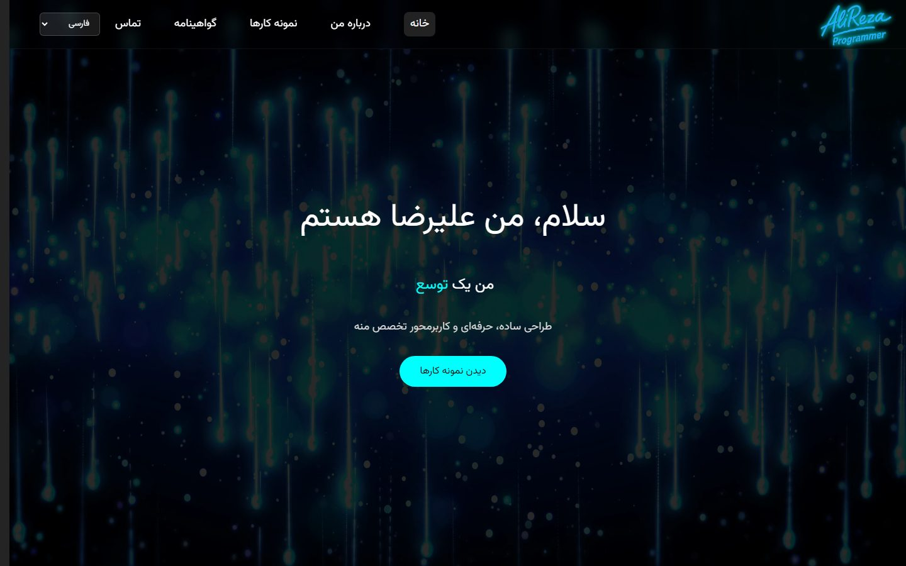

# Alireza Alamshah — Portfolio (Legacy)

An earlier version of my personal portfolio site, built with React + Vite. Verified working by running it locally.

> This is a previous version of the personal site. The current version lives in [new-portfolio](https://github.com/alirezaalamshah/new-portfolio), rebuilt with Astro.

---

### Screenshot



### About

A single-page React portfolio presenting projects, certificates (Python/React/Java, plus PDF proposals for a label-printing system and a modem-update presentation), and a contact section, previously deployed to `alirezaalamsha.ir`.

### Tech Stack

- React + Vite
- ESLint

### Getting Started

```bash
npm install
npm run dev
npm run build
```
